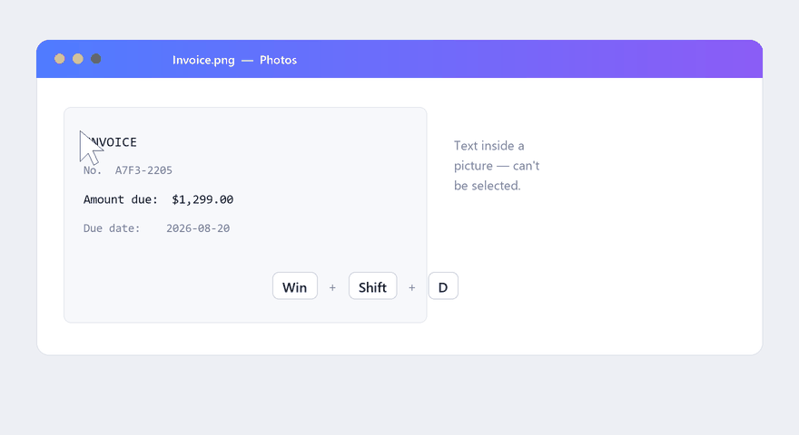

<div align="center">


# LookUp

**Захватывай любой текст с экрана — как скриншот, только на выходе текст.**

Нажми горячую клавишу, выдели рамкой что угодно на экране (картинку, PDF, видео,
окно ошибки, которое нельзя выделить) — и распознанный текст сразу окажется в
буфере обмена. Без облака и загрузок: распознавание идёт локально в Windows.

[](https://github.com/DenisDrobyshev/LookUp/releases)
[](https://github.com/DenisDrobyshev/LookUp/actions/workflows/release.yml)
[](LICENSE)


[English](README.md) · **Русский**



</div>

---

## Зачем

Скриншот можно снять чем угодно (`Win + Shift + S`), но на руках останется
*картинка*. Текст на изображениях, в сканах PDF, в видео или в приложениях, где
копирование заблокировано, нельзя выделить. **LookUp** сохраняет тот же жест
«выдели область» — только на выходе не картинка, а **текст**, готовый к вставке.

## Возможности

- 🖱️ **Снимок → текст** — привычное выделение прямоугольником, на всех мониторах.
- ⚡ **Быстро и локально** — работает на OCR, встроенном в Windows 10/11. Ничего
  никуда не отправляется; без API-ключей и аккаунтов.
- 🌍 **Много языков** — распознаёт любой язык, для которого установлен OCR
  (английский, русский, …). Переключение одним кликом из трея.
- 🪶 **Лёгкое** — одно приложение в трее. Одна глобальная горячая клавиша, не мешает.
- 📋 **Сразу в буфер** — выделил, и `Ctrl + V` куда нужно.
- 🔁 **Запуск при старте** — по желанию, включается из меню трея.

## Скачать

1. Открой страницу [**Releases**](https://github.com/DenisDrobyshev/LookUp/releases).
2. Скачай `LookUp-win-x64.zip` (self-contained — **.NET ставить не нужно**).
3. Распакуй куда угодно и запусти `LookUp.exe`. В системном трее появится
   небольшой значок.

### О предупреждении SmartScreen

Поскольку LookUp — новое приложение и пока не подписано сертификатом, при первом
запуске Windows SmartScreen может показать **«Система Windows защитила ваш
компьютер»**. Это нормально для любой небольшой независимой утилиты — нажми
**Подробнее → Выполнить в любом случае**.

Верить на слово не обязательно:

- Весь исходный код в этом репозитории, и можно **собрать точно такой же бинарник
  самому** (см. [Сборка из исходников](#сборка-из-исходников)).
- Приложение работает **полностью офлайн** — без сетевых запросов и аккаунтов.
- В каждом релизе есть `SHA256SUMS.txt`. Проверь, что скачанный файл совпадает:

  ```powershell
  Get-FileHash .\LookUp.exe -Algorithm SHA256
  ```

## Использование

| Действие | Как |
| --- | --- |
| **Захват текста** | Нажми `Win + Shift + D` и выдели рамкой нужный текст. |
| Отмена захвата | `Esc` или правый клик во время выделения. |
| Захват без горячей клавиши | Двойной клик по значку в трее. |
| Сменить язык OCR | Меню трея → **OCR language**. |
| Запуск при старте | Меню трея → **Run at Windows startup**. |
| Выход | Меню трея → **Quit LookUp**. |

Горячая клавиша по умолчанию — **`Win + Shift + D`** — тот же жест, что у
встроенного `Win + Shift + S`, только область возвращается текстом, а не
картинкой. Если комбинация уже занята другим приложением, LookUp откатывается на
двойной клик по значку в трее, а другую клавишу можно задать в настройках
(**Hotkey**).

### Первый запуск OCR

Windows распознаёт один язык за захват. В режиме **Auto** LookUp читает каждый
захват в алфавите **активной раскладки клавиатуры**: при английской раскладке
текст из букв, общих для двух алфавитов (вроде `CAT` / `САТ`), читается
латиницей; переключишься на русскую — те же начертания читаются кириллицей.
Цифры в обоих случаях одинаковы. Чтобы закрепить один язык независимо от
раскладки, выбери его в меню трея → **OCR language**. (В режиме Auto, если для
текущей раскладки нет установленного OCR-движка, происходит откат на язык
интерфейса Windows.)

Добавить языковой пакет: **Параметры Windows → Время и язык → Язык и регион →
(нужный язык) → Параметры языка → Оптическое распознавание символов**.

## Настройки

JSON, который можно править вручную, лежит в `%APPDATA%\LookUp\settings.json`
(меню трея → **Edit settings…**):

```json
{
  "Hotkey": "Win+Shift+D",
  "Language": "",
  "KeepLineBreaks": true
}
```

- **Hotkey** — любая комбинация `Ctrl` / `Alt` / `Shift` / `Win` плюс клавиша,
  например `Ctrl+Shift+2` или `Alt+Q`.
- **Language** — тег BCP-47, например `en` или `ru`, чтобы закрепить один язык.
  Пусто = Auto (следовать активной раскладке клавиатуры).
- **KeepLineBreaks** — сохранять переносы строк (`true`) или склеивать всё в одну
  строку (`false`).

## Сборка из исходников

Нужен [.NET SDK 9](https://dotnet.microsoft.com/download) на Windows 10/11.

```bash
git clone https://github.com/DenisDrobyshev/LookUp.git
cd LookUp
dotnet run --project src/LookUp/LookUp.csproj
```

Собрать тот же self-contained single file, что и в релизах:

```bash
dotnet publish src/LookUp/LookUp.csproj -c Release -r win-x64 ^
  --self-contained true -p:PublishSingleFile=true ^
  -p:IncludeNativeLibrariesForSelfExtract=true -p:EnableCompressionInSingleFile=true
```

Быстро проверить OCR-конвейер в headless-режиме:

```bash
LookUp.exe --selftest
# результат пишется в %TEMP%\lookup-selftest.txt
```

## Как это работает

LookUp замораживает экран, даёт выделить область, вырезает её и прогоняет через
**`Windows.Media.Ocr`** — встроенный в Windows OCR-движок, работающий прямо на
устройстве. Поэтому приложение маленькое и быстрое и не тащит с собой данные
моделей: оно переиспользует языковые пакеты, которые уже есть в Windows.
OCR-бэкенд спрятан за небольшим интерфейсом `IOcrEngine`, так что позже можно
подключить другие движки.

## Планы

- [ ] Кроссплатформенные сборки (macOS / Linux) через бэкенд Tesseract за тем же
      интерфейсом `IOcrEngine`.
- [ ] История «последних N захватов».
- [ ] Опционально: вставлять распознанный текст сразу, а не только копировать.
- [ ] Выбор горячей клавиши внутри приложения (без правки JSON).
- [ ] Захват с учётом DPI каждого монитора для пиксельно-точных снимков на
      мониторах со смешанным DPI.

Идеи и issue приветствуются.

## Лицензия

[MIT](LICENSE) © Denis Drobyshev
